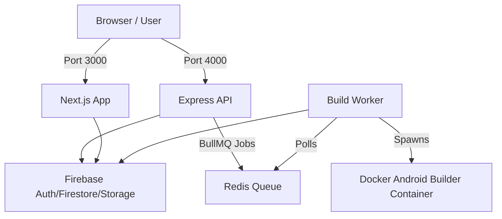

# AppForge Deployment Guide

AppForge is a monorepo comprising a Next.js frontend, an Express backend, a Redis queue, a Firebase project integration, and a Docker-based Android compilation worker.

Due to the build worker requiring **Docker-in-Docker** (to spawn `android-builder` containers for APK builds), hosting this project requires a Virtual Private Server (VPS) or Cloud VM (e.g., DigitalOcean, AWS EC2, Google Compute Engine, Hetzner, Linode) rather than a static or serverless platform like Vercel or Netlify.

---

## Architecture Overview



---

## Step 1: Server Requirements & Setup

1. **Recommended Specifications**:
   - **OS**: Ubuntu 22.04 LTS (recommended)
   - **CPU**: 4 vCPUs or more (since compiling Android projects is CPU intensive)
   - **RAM**: 8 GB RAM or more (Android builds require at least 4 GB allocated to the container)
   - **Disk**: 40 GB+ SSD (to store Gradle cache volumes and builder Docker image)

2. **Server Package Installation**:
   Once logged into your VPS via SSH, install the required software:
   ```bash
   # Update package list
   sudo apt update && sudo apt upgrade -y

   # Install Docker & Docker Compose
   sudo apt install docker.io docker-compose -y
   sudo usermod -aG docker $USER
   # (Log out and log back in to apply Docker group changes)

   # Install Node.js (LTS version 20+)
   curl -fsSL https://deb.nodesource.com/setup_20.x | sudo -E bash -
   sudo apt install -y nodejs
   ```

---

## Step 2: Clone the Project and Set Up Environment

1. Clone your repository:
   ```bash
   git clone https://github.com/aqmmarshaikh/web-to-app-converter-.git
   cd web-to-app-converter-
   ```

2. Configure environment variables.
   You must set up `.env` files in both the backend and frontend directories based on the `.env.example` templates:

   - **Backend Environment File** (`apps/backend/.env`):
     ```env
     PORT=4000
     NODE_ENV=production
     API_URL=https://api.yourdomain.com
     FRONTEND_URL=https://yourdomain.com
     REDIS_HOST=localhost
     REDIS_PORT=6379
     
     # Firebase configurations
     FIREBASE_PROJECT_ID=your-project-id
     FIREBASE_CLIENT_EMAIL=your-client-email
     FIREBASE_PRIVATE_KEY="your-private-key-with-escaped-newlines"
     FIREBASE_STORAGE_BUCKET=your-project.appspot.com
     ```
   
   - **Frontend Environment File** (`apps/frontend/.env`):
     ```env
     NEXT_PUBLIC_API_URL=https://api.yourdomain.com
     
     # Firebase Web configuration
     NEXT_PUBLIC_FIREBASE_API_KEY=your-api-key
     NEXT_PUBLIC_FIREBASE_AUTH_DOMAIN=your-project.firebaseapp.com
     NEXT_PUBLIC_FIREBASE_PROJECT_ID=your-project-id
     NEXT_PUBLIC_FIREBASE_STORAGE_BUCKET=your-project.appspot.com
     NEXT_PUBLIC_FIREBASE_MESSAGING_SENDER_ID=your-sender-id
     NEXT_PUBLIC_FIREBASE_APP_ID=your-app-id
     ```

3. **Firebase Credentials Setup**:
   Ensure you copy the Firebase Admin SDK private key JSON file to `apps/backend/firebase-adminsdk.json` as detailed in the setup notes.

---

## Step 3: Run the Services using Docker Compose (Recommended)

The project includes a `docker/docker-compose.yml` config that spawns Redis, the backend, and the frontend altogether. 

1. Build the production Docker images:
   ```bash
   docker-compose -f docker/docker-compose.yml build
   ```

2. Start the entire stack in detached mode:
   ```bash
   docker-compose -f docker/docker-compose.yml up -d
   ```

3. Verify everything is running:
   ```bash
   docker ps
   ```

---

## Step 4: Reverse Proxy & SSL (Nginx + Let's Encrypt)

To serve your frontend and API over HTTPS, set up Nginx:

1. Install Nginx:
   ```bash
   sudo apt install nginx -y
   ```

2. Create an Nginx config (`/etc/nginx/sites-available/appforge`):
   ```nginx
   server {
       listen 80;
       server_name yourdomain.com;

       location / {
           proxy_pass http://localhost:3000; # Frontend Next.js
           proxy_http_version 1.1;
           proxy_set_header Upgrade $http_upgrade;
           proxy_set_header Connection 'upgrade';
           proxy_set_header Host $host;
           proxy_cache_bypass $http_upgrade;
       }
   }

   server {
       listen 80;
       server_name api.yourdomain.com;

       location / {
           proxy_pass http://localhost:4000; # Backend API
           proxy_http_version 1.1;
           proxy_set_header Upgrade $http_upgrade;
           proxy_set_header Connection 'upgrade';
           proxy_set_header Host $host;
           proxy_cache_bypass $http_upgrade;
       }
   }
   ```

3. Enable the site and restart Nginx:
   ```bash
   sudo ln -s /etc/nginx/sites-available/appforge /etc/nginx/sites-enabled/
   sudo systemctl restart nginx
   ```

4. Install Certbot to generate free SSL certificates automatically:
   ```bash
   sudo apt install certbot python3-certbot-nginx -y
   sudo certbot --nginx -d yourdomain.com -d api.yourdomain.com
   ```
